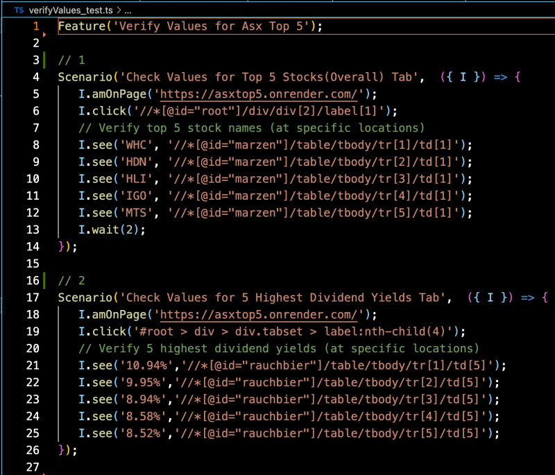
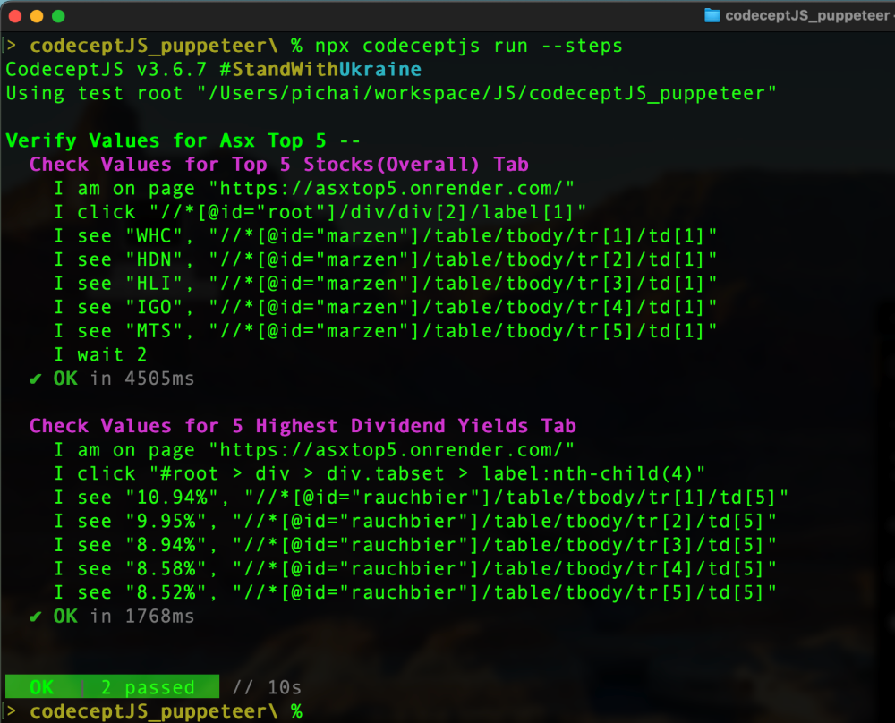
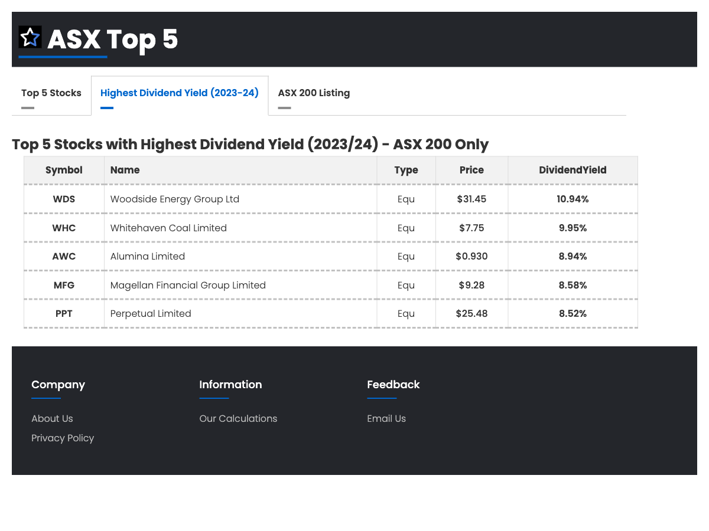

# Puppeteer with CodeCeptJS:

This repo contains demo tests for https://asxtop5.onrender.com/ page by using a test framework of "Puppeteer with CodeCeptJS Framework"

# Installation

This is a playground for your first steps in testing with Typescript, so instead of installing it from NPM it is recommended to clone it from repo instead and then install the dependencies:

```
  git clone git@github.com:pichai-t/puppeteer_with_codeceptJS.git && cd puppeteer_with_codeceptJS && npm i 
```

**This will also install CodeceptJS with Puppeteer packages

# Running Tests with Puppeteer


Use `codecept.conf.ts` to run tests with Puppeteer via this command:

```
  npx codeceptjs run --steps  
```

## Test Scenarios: 



## Test Execution: 



## Screenshots

_Tab.png)



## Credits

Created by Pichai Tangtrong

## LICENSE

MIT